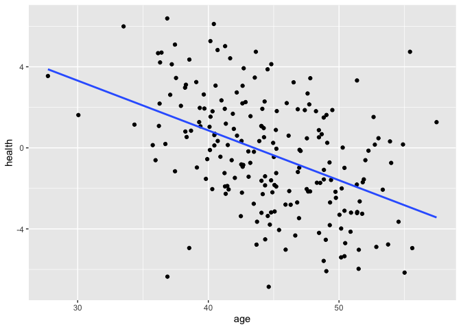

# How to simulate data in R

## Setup

``` r
library(tidyverse)
library(faux)
```

## Simulation Population

Simulation einer Population.

``` r
data <- rnorm_multi(
  n = 200, 
  mu = c(0, 45, 180),
  sd = c(3, 5, 5),
  r = c(-0.5, 0.5, 0.25), 
  varnames = c("health", "age", "heigth"),
  empirical = FALSE
  )
```

``` r
data %>% 
  ggplot(aes(x = age, y = health)) +
  geom_point() +
  geom_smooth(formula = y ~ x, method = lm, se = F)
```



$s=\sqrt{\frac{1}{N-1}\sum_{i=1}^N(x_i-\bar{x})^2}$

$s=\sqrt{\frac{\sum_{i=1}^N(x_i-\bar{x})^2}{N-1}}$
